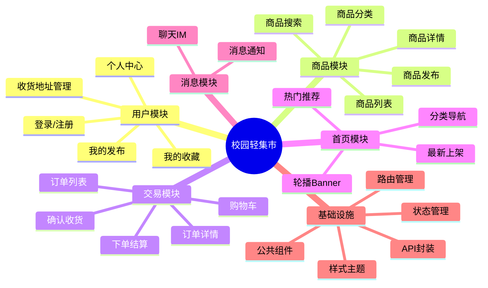

# 校园轻集市 — 项目规划

> 基于 Vue 3 + TypeScript + Pinia + Vue Router 的校园二手交易平台前端项目

---

## 一、项目架构总览（Mermaid 思维导图）

---

## 二、页面清单

| 序号 | 页面名称 | 路由路径 | 优先级 | 说明 |
|------|----------|----------|--------|------|
| 1 | 首页 | `/` | P0 | 商品列表、搜索入口、分类导航 |
| 2 | 商品详情 | `/goods/:id` | P0 | 商品图片、描述、价格、发布者信息 |
| 3 | 登录 | `/login` | P0 | 用户名/密码登录 |
| 4 | 注册 | `/register` | P0 | 用户注册 |
| 5 | 商品发布 | `/publish` | P1 | 上传图片、填写描述、设置价格 |
| 6 | 个人中心 | `/user` | P1 | 个人信息、我的发布、我的订单 |
| 7 | 我的发布 | `/user/goods` | P1 | 管理已发布的商品 |
| 8 | 购物车 | `/cart` | P1 | 商品暂存、批量结算 |
| 9 | 订单确认 | `/order/confirm` | P1 | 选择地址、确认金额 |
| 10 | 订单列表 | `/orders` | P2 | 全部/待付款/待发货/待收货 |
| 11 | 订单详情 | `/orders/:id` | P2 | 订单状态、物流信息 |
| 12 | 收藏列表 | `/user/favorites` | P2 | 收藏的商品 |
| 13 | 收货地址 | `/user/address` | P2 | 地址增删改 |
| 14 | 消息通知 | `/messages` | P3 | 系统消息、交易提醒 |
| 15 | 聊天 | `/chat/:userId` | P3 | 买卖双方即时通讯 |

---

## 三、功能模块

### 模块 1：用户认证
- 登录/注册表单
- Token 管理（存储在 Pinia + localStorage）
- 路由守卫（未登录拦截）
- 自动登录（Token 持久化）

### 模块 2：商品管理
- 商品 CRUD（创建、读取、更新、删除）
- 图片上传（多图）
- 商品分类筛选
- 关键词搜索
- 价格排序
- 分页加载

### 模块 3：购物车 & 交易
- 加入购物车
- 数量修改
- 选中结算
- 订单创建
- 订单状态流转

### 模块 4：用户中心
- 个人信息编辑
- 发布商品管理（上架/下架/删除）
- 收藏管理
- 地址管理（省市区联动）

### 模块 5：消息 & 互动
- 系统通知
- 交易状态推送
- 简易聊天

### 模块 6：基础设施
- API 请求封装（axios + 拦截器）
- 全局状态管理（Pinia stores）
- 公共组件库（NavBar、TabBar、Empty、Loading 等）
- 路由配置（动态路由 + 导航守卫）
- 样式系统（CSS 变量 + 响应式布局）

---

## 四、开发顺序（7 天实训）

| 日期 | 阶段 | 主要任务 | 产出 |
|------|------|----------|------|
| **Day 1** | 项目理解 | 阅读文档、分析目录、理解架构、AI 协作体验、项目规划 | Day1 Evidence |
| **Day 2** | 基础搭建 | 首页布局、路由框架、API 封装、Pinia 初始化 | 首页 + 路由骨架 |
| **Day 3** | 用户模块 | 登录注册页面、Token 管理、路由守卫 | 用户认证完整流程 |
| **Day 4** | 商品模块 | 商品列表、商品详情、商品发布 | 商品核心功能 |
| **Day 5** | 交易模块 | 购物车、下单、订单管理 | 交易闭环 |
| **Day 6** | 用户中心 | 个人信息、地址管理、收藏、消息 | 用户端完整体验 |
| **Day 7** | 完善收尾 | 联调测试、Bug 修复、代码优化、最终提交 | 可交付项目 |

---

## 五、开发重点（个人判断）

### 🔴 重点 1：路由设计
- **原因：** 路由是整个应用的骨架，决定了页面跳转逻辑和用户体验
- **关注：** 嵌套路由、路由守卫（鉴权）、路由懒加载

### 🔴 重点 2：状态管理（Pinia）
- **原因：** 用户登录态、购物车数据、商品列表等需要跨组件共享
- **关注：** Store 拆分粒度、响应式数据设计、持久化策略

### 🔴 重点 3：API 层封装
- **原因：** 所有页面依赖后端接口，统一的请求管理避免代码重复
- **关注：** 请求/响应拦截器、错误处理、Token 自动携带

### 🟡 重点 4：组件复用
- **原因：** 良好的组件设计减少重复代码，提升开发效率
- **关注：** 商品卡片、列表项、空状态、加载态等公共组件

### 🟡 重点 5：类型安全
- **原因：** TypeScript 在编译阶段发现潜在 bug
- **关注：** 接口类型定义、API 响应类型、Props 类型约束

### 🟢 重点 6：Git 规范
- **原因：** 过程性评价依赖 Git 提交记录
- **关注：** 及时提交、规范 Commit Message、保持项目可运行

---

## 六、技术风险 & 应对

| 风险 | 影响 | 应对策略 |
|------|------|----------|
| API 接口未就绪 | 阻塞前端开发 | 使用 Mock 数据先行开发 |
| 图片上传复杂 | 商品发布延期 | 优先完成文本功能，图片作为增强 |
| 状态管理混乱 | 数据流难以追踪 | 严格遵循 Pinia 最佳实践，一个 Store 管一个域 |
| 时间不足 | 功能未完成 | 优先保证 P0 和 P1 功能，P2/P3 作为选做 |

---

> 📝 本规划基于项目种子代码和课程文档分析得出，具体实现将根据每日实训指引调整。
